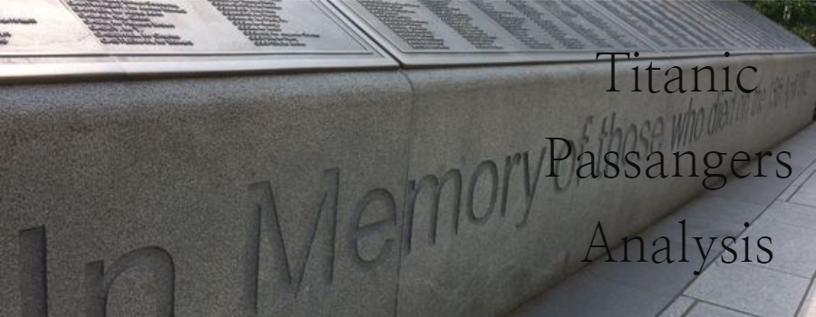

Welcome to the Titanic Data Analysis project! This project was created as part of the first module of our bootcamp. It involves cleaning, transforming, and visualizing data using Python, culminating in a user-friendly Streamlit application that presents the results.

## Introduction
The RMS Titanic was a British passenger liner that embarked on its maiden voyage from Southampton to New York City on April 10, 1912. Renowned for its luxury and deemed "unsinkable," the ship tragically struck an iceberg on April 14, 1912, and sank in the early hours of April 15. Over 1,500 of the 2,224 passengers and crew lost their lives in one of the deadliest maritime disasters in history.

Often, when we talk about the Titanic, we focus on the movie, and we forget that the event was real and many people lost their lives. This project aims to remember those who perished and to analyze the data related to this tragic event.

## Project Overview
### Data Cleaning and Transformation
- Handling missing values
- Converting data types
- Feature engineering

### Data Visualization
- Creating visualizations to understand the distribution of passengers
- Analyzing survival rates based on different criteria such as class, gender, and age.

### Streamlit [*Application*]([https://titanic-quintana.streamlit.app](https://titanic-data-analysis-app.streamlit.app/)) -- Click here to access!
- Developing a user-friendly interface to present the analysis results
- Allowing users to interact with the data and visualizations

*Note: Sometimes, the app might go to sleep due to inactivity. If you see a message saying, "This app has gone to sleep due to inactivity. Would you like to wake it back up?" click on "Yes, get this app back up!" to restart the application.*

### Technologies Used
Python
Pandas
NumPy
Matplotlib
Streamlit
Plotly

### Conclusion
This project serves as a tribute to the victims of the Titanic disaster by analyzing and visualizing the data related to this historical event. We hope that through this analysis, we can gain insights and remember the real stories behind the tragedy.

### Image Credits
All images included in this project are sourced from [Pinterest](https://www.pinterest.es)

